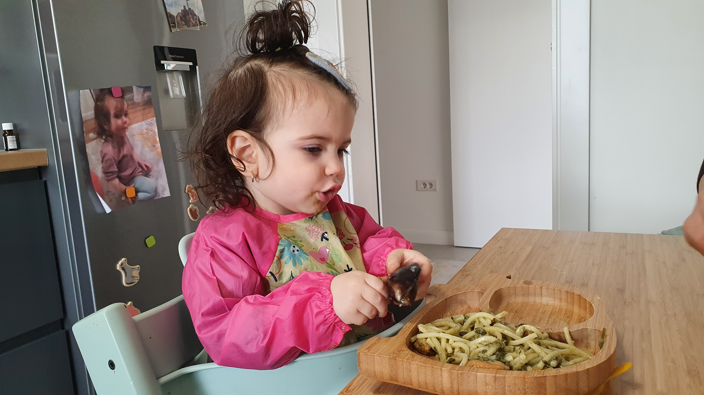

## O introducere ușoară la fructe de mare

- de la 1 an
- timp de preparare: 20-25min
- pe foc: 13min

## Ingrediente

- 250g spaghete
- 500g midii
- 3-4 fire de ceapă verde
- ghimbir
- 200 ml apă
- 25g unt
- 2 linguri ulei de măsline
- piper cayenne
- usturoi
- 1/2 lămâie
- pătrunjel
- parmezan (de decor)

## Cum am făcut

Am spălat midiile și le-am curățat de aripi. Dacă folosești midii proaspete, ar trebui să îndepărtezi depunerile de calciu de pe cochilii. Ia un cuțit și râcâie bine &emdash; pot ajuta și cei mici cu o linguriță!

Am blenduit o legătură de ceapă verde cu o bucată de ghimbir și 200 ml apă.
Am pus la topit 25g unt în 2 linguri de ulei de măsline.
Am adăugat blendul și am lăsat pe foc până și-a modificat culoarea (2-3 minute).
Am pus midiile în sos și am adăugat piper cayenne și usturoi granule după gust.
Am lăsat 10 minute să fiarbă sub capac, mestecând la jumătatea timpului.

Am scos câteva midii pe un platou. Pot fi lăsate câteva pentru un gust mai intens al sosului.

> Midiile în cochilie ar trebui să se deschidă frumos. Dacă rămân câteva închise, ar fi bine să le arunci, pentru că nu sunt făcute.

Am lăsat sosul să mai fiarbă și să scadă, adăugând zeama de lămâie și un pumn de pătrunjel.
Separat am fiert bine spaghetele, 1-2 minute mai mult decât scrie pe ambalaj.

Le-am asamblat la final cu una-două cochilii în farfurie.

## Pentru adulți

Ar fi mers frumos cu un pahar de vin alb, poate și un pic în sos. Dar ne mulțumim cu puțin parmezan presărat în farfurie &mdash; n-am mai mâncat sărat de ceva vreme.

Poftă bună!
